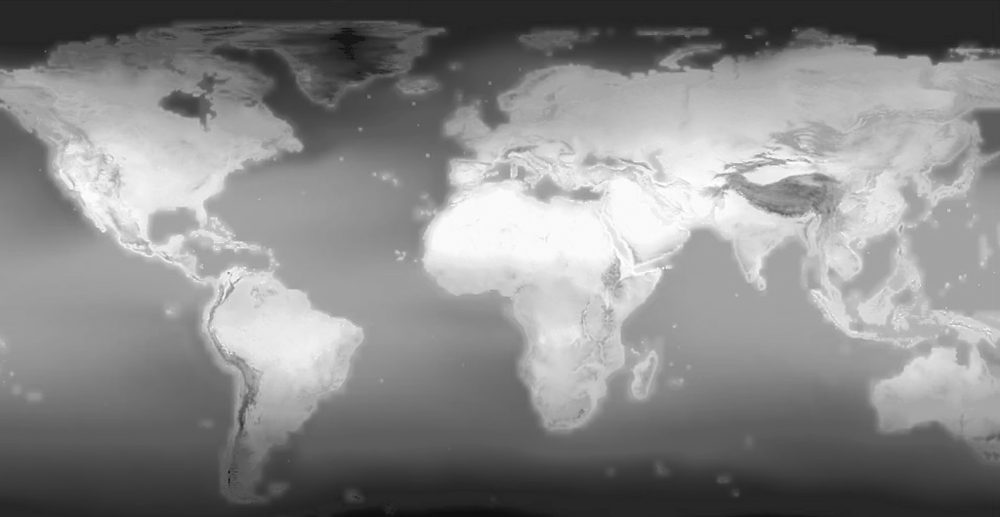

# Heatmap Generator

using Scipy to draw heatmaps from arbitrary sensor locations and values.


## generate training data

input image:  


### recovering numerical values from JET gradient (_reverse_colormap.py_) 
```python
python reverse_colormap.py --image images/temperature.png --cmap jet --output images/temperature_values.png
```




### validating by re-applying JET for comparison


### sampling numerical values at random positions 

and scaling them to given [min, max] range (_sample_from_map.py_)   

```python
python sample_from_map.py --image images/temperature_values.png --samples 1000 --range -20 40
```

colormap is applied only for visualisation.


## create maps from data (_heatmap.py_)

```python
python heatmap.py --sensors data/sensors.json --values data/values.json --cmap JET --width 1024 --height 530 --interpolation linear --blur 3
```

nearest neighbor w/o color mapping: (1000 samples)


nearest neighbor with "VIRIDIS": (1000 samples)


linear interpolation with "JET": (10k samples)


linear interpolation with "INFERNO": (10k samples)


## run in virtualenv:
```python
python3 -m venv .venv
source .venv/bin/activate
pip install -r requirements.txt
python heatmap.py # ..
```